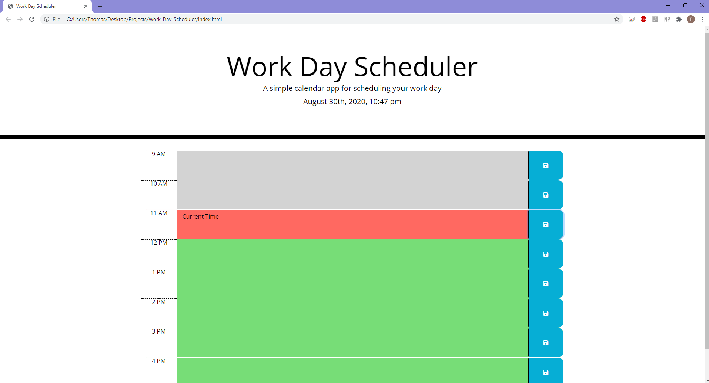
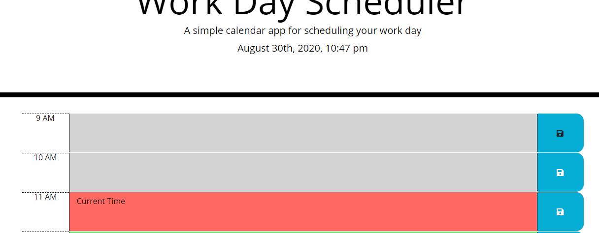

## Challenge 5 - Work Day Scheduler

## Purpose
Create a simple calendar application that allows a user to save events fo reach hour of the day.

## Task
In challenge 5, the task was to create an hourly tracker with the following requirements:
- Current day displayed at the top of the calendar
- Time blocks are presented
- Time blocks are color-coded based on the time
- Clicking on a time-block allows uers to enter an event
- Clicking the sve button will save the event in local storage
- Refreshing page will show the saved events

## Screenshots
Current Time Page

Hover Over Save Button

## URL
https://thomasnguyen546.github.io/Work-Day-Scheduler/
